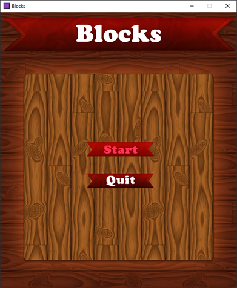
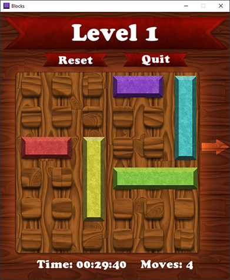
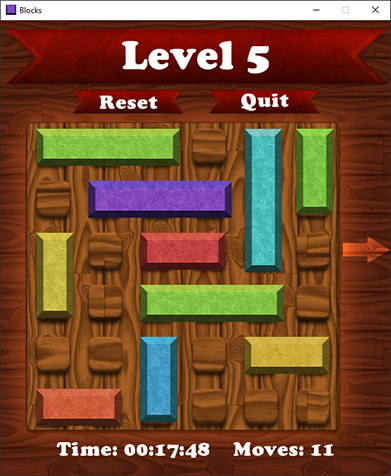
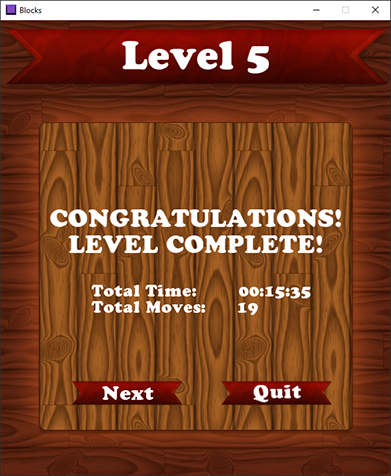

# Blocks

## Description:
Blocks is a 2D puzzle game where the objective is to rearrange the blocks (horizontally or vertically) so that you can push the red block out of the board. The blocks can only move in the direction of their orientation. Blocks positioned vertically can only move vertically, likewise, blocks positioned horizontally can only move horizontally. To slide a block, simply click on the block to select it and move the mouse, release the mouse to position the block. The number of moves and amount of time taken are displayed when the level is successfully completed.

	
	
    
	

## Supports:
- Microsoft Windows 7, 8, 8.1 and 10
- Linux based distributions
- Mac OS X

## Dependencies:
- **Compiler**
	- G++ or Microsoft Visual Studio 2015 [Community Edition](https://www.visualstudio.com/en-us/downloads/download-visual-studio-vs.aspx)
- **Libraries**
	- SFML 32-bit [(Build 2.3.2)](http://www.sfml-dev.org/download/sfml/2.3.2/)
	- PhysicsFS [(Build 2.0.3)](https://icculus.org/physfs/downloads/)
	- CocoaDialog [(Build 2.1.1)](https://mstratman.github.io/cocoadialog/#download)

## Build Instructions:
Please refer to the [Wiki Section](https://github.com/SalinderSidhu/Blocks/wiki) for instruction on compiling and building Blocks.

## Credits:
- **Audio**
	- Button click sound created by **josepharaoh99** from [freesound](https://www.freesound.org/people/josepharaoh99/sounds/379339/) under [CC0 1.0](https://creativecommons.org/publicdomain/zero/1.0/)
	- Button hover sound created by **plasterbrain** from [freesound](https://www.freesound.org/people/plasterbrain/sounds/237422/) under [CC0 1.0](https://creativecommons.org/publicdomain/zero/1.0/)
	- Level complete sound created by **Tuudurt** from [freesound](https://www.freesound.org/people/Tuudurt/sounds/275104/) under [CC0 1.0](https://creativecommons.org/publicdomain/zero/1.0/)
	- Background music created by **Sirkoto51** from [freesound](https://www.freesound.org/people/Sirkoto51/sounds/378110/) under [CC Attribution 3.0](https://creativecommons.org/licenses/by/3.0/)
- **Graphics**
	- Ribbon inspired from a Photoshop [Ribbon Tutorial](http://www.photoshopstar.com/web-design/cartoon-ribbon/)
	- Blocks, Grid and Background created exclusively using Photoshop

## License:

